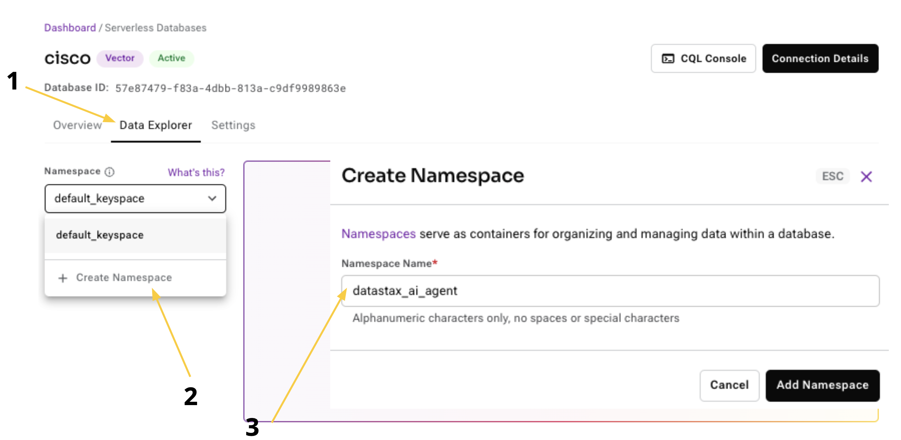
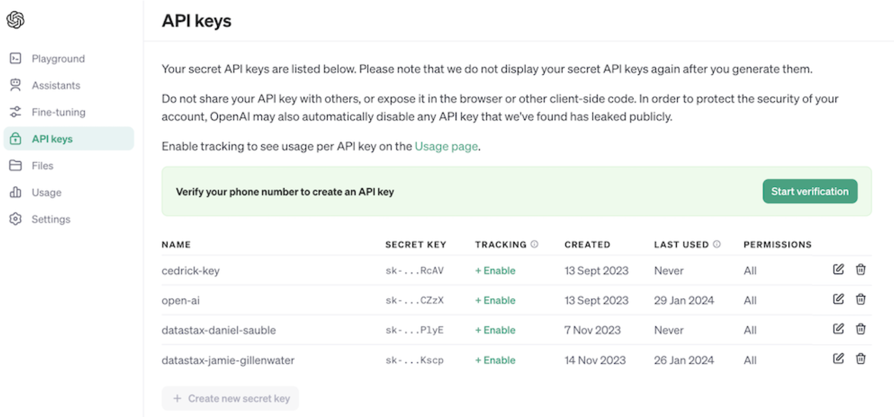
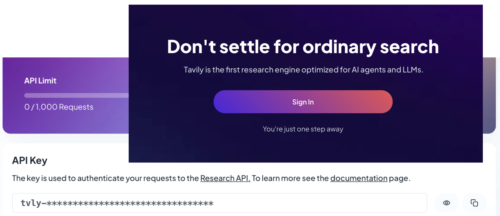

# Build your own Java RAG AI Agent

 ⬅ This is the next workshop step after the [introduction step](../workshop-intro).

## Requirements Setup

 🙇‍ The workshop will use the services: OpenAI, Tavily, and AstraDB. You will need accounts and api keys for each of these.


### Sign up for Astra DB ✍️

Go to astra.datastax.com, sign-in, and create a vector-capable Astra database.
- Get the Application Token for your database, also in the right pane.
- You need the API Endpoint found in the right pane underneath Database details.


 

### Create Astra Namespace

- Create Namespace “datastax_ai_agent”



 ⚠️ Make sure you have full permissions on this new namespace.
Permissions are found under left pane "Settings → Roles → ︙ → Edit Role → select all keyspaces".


### Sign up for OpenAI ✍️

- Create an [OpenAI account](https://platform.openai.com/signup), or sign in.
- Navigate to the [API key page](https://platform.openai.com/account/api-keys) and create a new Secret Key, optionally naming the key.


 

### Sign up for Tavily ✍️

- Create an [Tavily account](https://app.tavily.com/sign-in), or sign in.
- Navigate to the [API key page](https://app.tavily.com/home) and copy your API Key.



 

## Next… 

 💪🏽 To move on to the first step, [step-0](../workshop-step-0), do the following:
```
git switch workshop-step-0
```


***
      

*** 
All work is copyrighted to DataStax, Inc
  